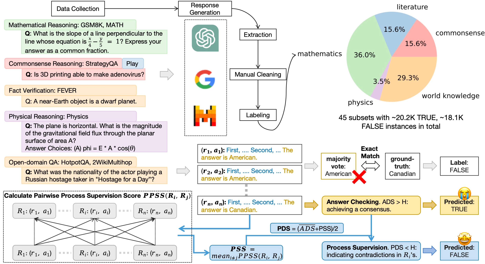

<h1 align="center"><span style="color: #3498db;">Can We Verify Step by Step for Incorrect Answer Detection?</h1>
<p align="center">
   🤗 <a href="https://huggingface.co/datasets/xx18/R2PE" target="_blank">Hugging Face Dataset</a> •   📃 <a href="https://arxiv.org/pdf/2402.10528.pdf" target="_blank">Paper</a> 
</p>

- Source Code for paper "[Can We Verify Step by Step for Incorrect Answer Detection?](https://arxiv.org/abs/2402.10528)"
- R2PE (Relation of Rationales and Performance Evaluation) is the first benchmark to  explore the connection between reasoning chains and end-task performance.
<div align="center">
    
</div>

## Download
- Method 1: clone the dataset repository and the datasets are under `R2PE/data` folder:
```bash
git clone https://github.com/XinXU-USTC/R2PE.git
cd R2PE
git lfs install
git clone https://huggingface.co/datasets/xx18/R2PE
mv R2PE/data ./
```
- Method 2: Load the dataset using [Hugging Face datasets](https://huggingface.co/datasets/xx18/R2PE):
```python
from datasets import load_dataset
dataset = load_dataset("xx18/R2PE", 'HotpotQA')['gpt4'] # other split see [Hugging Face datasets](https://huggingface.co/datasets/xx18/R2PE)
```

## Dataset Description


#### Data Fields

| Field Name  | Value | Description                                 |
| ----------- | ----------- | ------------------------------------------- |
| question         | string     | The question or claim used to query LLM from the original dataset.         |
| id          | string or int | id of 'question' in the original dataset
| dataset   | string      | Which dataset Q is from? (FEVER, HotpotQA, or 2WikiMultihop)   |
| llm           | string      |       gpt-4-0314 or text-davinci-003            |
| responses           | list      | A list of five responses generated by 'llm name' for a 'question' from the 'dataset'. Each response contains a rationale and an answer                  |
| rationales           | list      | A list of rationales segmented from 'responses'.                  |
| answers         | list      | A list of answers segmented from 'responses'.                  |
| output     | string      | The final answer selected from 'answers' by majority voting. |
| ground-truth | list or string     |  The ground-truth answer or answer list provided for 'question' from the 'dataset'.       |
| label | Boolean      |   {True, False} to indicate whether 'output' matches the 'ground-truth'.       |

#### Data Instances
An example looks as follows:

```python
{'question': 'Which film was released earlier, Navavadhu or The January Man?',
 'id': '5effec28087111ebbd63ac1f6bf848b6'
 'dataset': '2WikiMultihop',
 'llm': 'text-davinci-003'
 'repsonses': ["First, Navavadhu was released on 15 February 2019. Second, The January Man was released on 17 February 1989. The answer is The January Man.",
              "First, film Navavadhu was released on 17 August 1979. Second, The January Man was released on 24 August 1989. The answer is Navavadhu.",
              "First, film Navavadhu was released on 8 April 1988. Second, The January Man was released on 11 August 1989. The answer is Navavadhu.",
              "First, film Navavadhu was released on 21 August 1992. Second, The January Man was released on 11 August 1989. The answer is The January Man.",
              "First, film Navavadhu was released on 15 February 2019. Second, The January Man was released on 10 February 1989. The answer is The January Man."],
 'rationales': ["First, Navavadhu was released on 15 February 2019. Second, The January Man was released on 17 February 1989.",
              "First, film Navavadhu was released on 17 August 1979. Second, The January Man was released on 24 August 1989.",
              "First, film Navavadhu was released on 8 April 1988. Second, The January Man was released on 11 August 1989.",
              "First, film Navavadhu was released on 21 August 1992. Second, The January Man was released on 11 August 1989.",
              "First, film Navavadhu was released on 15 February 2019. Second, The January Man was released on 10 February 1989."],
 'answers': ["The January Man", "Navavadhu", "Navavadhu", "The January Man", "The January Man"],
 'output':  "The January Man",
 'ground-truth': 'Navavadhu',
 'label': False}
```
## Evaluation
To reproduce our results:
```bash
python runner.py --dataset HotpotQA --model gpt4-0314 --method ADS
```
- `--dataset`: The name of the dataset. `choices = [gsm8k, math, StrategyQA, play, physics, Fever, HotpotQA, 2WikiMultihop]`.
- `--model`: The LLM used to generate responses. `choices = [text-davinci-003, gpt-3.5-turbo-instruct, gpt-3.5-trubo-1106/gpt-4-0314, gemini-pro, mixtral-8x7b, mistral-medium]`.
- `--method`: Method to predict binary label. `choices = [ADS, PDS]`.
## Contact information
For help or issues about R2PE, please submit a GitHub issue.

For personal communication related to our work, please contact Xin XU (xxuca@connect.ust.hk) or Shizhe Diao (sdiaoaa@connect.ust.hk).


## Licenses

[](https://lbesson.mit-license.org/)

This work is licensed under a [MIT License](https://lbesson.mit-license.org/).

[](https://lbesson.mit-license.org/)

The R2PE dataset is licensed under a
[MIT License](https://lbesson.mit-license.org/).


## Citation

Please cite our paper if you use our dataset or extend our work:
```bibtex
@misc{xu2024verify,
      title={Can We Verify Step by Step for Incorrect Answer Detection?}, 
      author={Xin Xu and Shizhe Diao and Can Yang and Yang Wang},
      year={2024},
      eprint={2402.10528},
      archivePrefix={arXiv},
      primaryClass={cs.CL}
}
```

